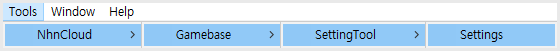
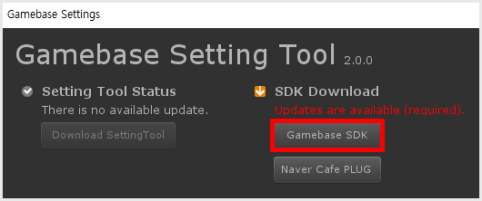

#######################
SDK 다운로드
#######################

Setting Tool을 이용하여 Gamebase SDK를 다운로드합니다.

Setting Tool 실행
=======================

**Menu > Tools > NhnCloud > Gamebase > SettingTool > Settings**

Gamebase SDK 다운로드
=======================

Click **Download SDK**

Gamebase SDK 확인
=======================

{PROJECT PATH}/GamebaseSDK

