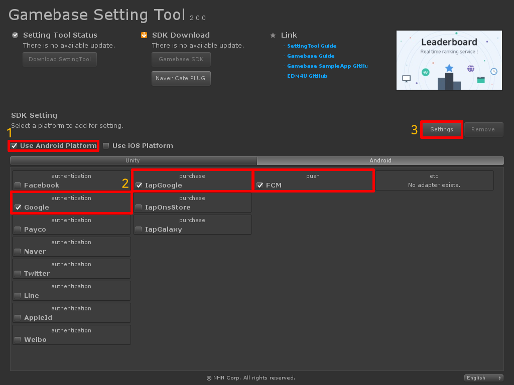

###################
SDK 설치
###################

Setting Tool을 통해서 Gamebase SDK를 설치합니다.

플랫폼 선택
=============

Gamebase SDK를 적용할 플랫폼을 선택합니다.

1. Android 

2. iOS

모듈 선택
============

Gamebase SDK에서 사용하고자 하는 모듈을 선택합니다.

1. Authentication
    - Google과 같은 ID Provider(IdP)와의 연동을 지원합니다.

2. Push
    - FCM(Firebase), Tencent, APNS Push 등의 서비스를 지원합니다.

3. Purchase
    - TOAST 결제 서비스인 IAP(In-App Purchase)를 사용하여 결제를 지원합니다.

설치
===========

원하는 플랫폼과 모듈을 선택했으면 Gamebase SDK를 설치합니다.

가이드에서는 Android Platform, Google IdP, FCM을 선택하도록 하겠습니다.

* Click **Settings**
* 설치 완료 후에는 Gamebase 폴더를 확인할 수 있습니다.

