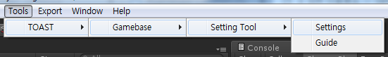
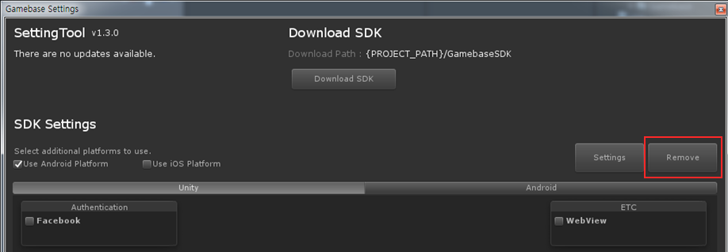

###################
SDK 삭제
###################
  
Setting Tool 실행
===================

**Menu > Tools > NhnCloud > Gamebase > SettingTool > Settings**

삭제
===================

.. tip:: 
  * 다음 핸즈온 랩을 진행하기 위해서는 지금까지의 설정이 필요하니, **Remove** 를 클릭하지 마십시오.
  * **Remove** 를 클릭하였다면 **4.1 Setting Tool 설정** 을 다시 수행하시기 바랍니다.

Click **Remove**

