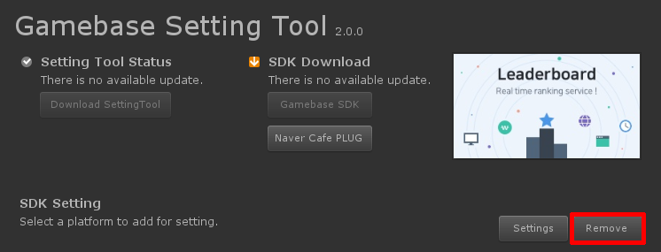

###################
SDK 삭제
###################

Setting Tool을 이용하여 설치한 Gamebase SDK를 삭제합니다.

Setting Tool 실행
===================

**Menu > Tools > NhnCloud > Gamebase > SettingTool > Settings**

.. image:: _static/image/unity-menu-settingtool.png

삭제
===================

Click **Remove**

