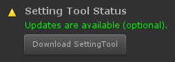

#########################
Setting Tool 업데이트
#########################

Setting Tool의 업데이트가 필요한 경우 Setting Tool에서 업데이트 여부를 알려드립니다.

강제 업데이트
================

치명적인 오류가 수정되었거나, 전체 흐름에 영향을 주는 코드가 추가 및 수정된 경우입니다.

선택 업데이트
================

경미한 오류가 수정되었거나, 기능이 추가된 경우입니다.

